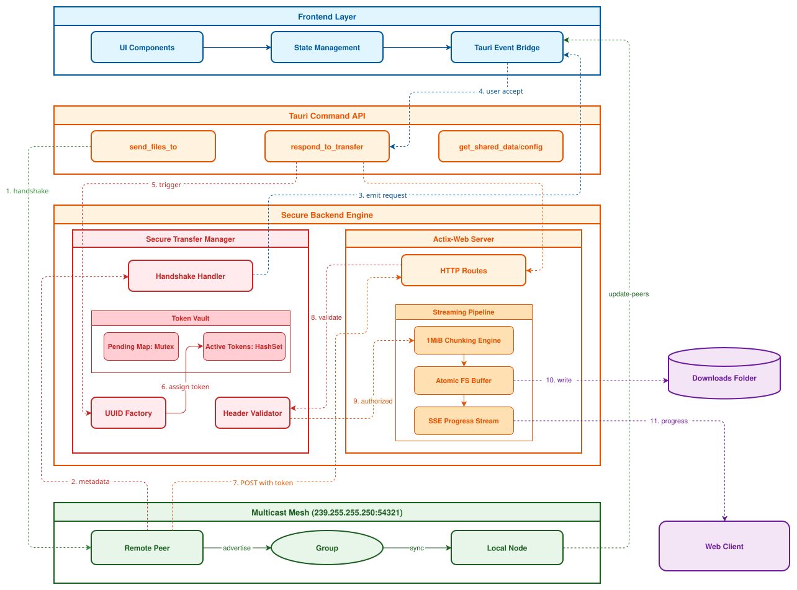

<h1>Zap Share</h1>

## Table of Contents

- [Introduction](#introduction)
- [Supported Platforms](#supported-platforms)
- [Installation](#installation)
- [How it Works](#how-it-works)
- [Contributors](#contributors)

## Introduction

Zap Share is a cross-platform desktop and mobile application for sharing files and text instantly over a local network. It requires no internet connection, no account, and no configuration, just open the app and share.

When a user initiates a transfer, Zap Share spins up a lightweight HTTP server on the local network using [Actix-web](https://actix.rs/). The receiving device connects via a QR code or URL, and data is streamed directly between the two peers. Every transfer is short-lived: the server starts on demand and stops when the session ends.

The application is built on [Tauri](https://tauri.app/), combining a Rust backend for performance and a React frontend for a smooth user experience.

## Supported Platforms

| Platform | Supported |
|----------|--------|
| Windows  | Yes |
| Linux    | Yes |
| Android  | Yes |

## Installation

See [INSTALL.md](INSTALL.md) for instructions.

## How it Works

1. Select files or enter text to share on the sender's device.
2. Zap Share starts a local HTTP server and displays a QR code with the connection URL.
3. The recipient scans the QR code or enters the URL in a browser or the Zap Share app.
4. Files and text are streamed directly over the local network, no data leaves the LAN.

## Contributors

| Name | GitHub |
|------|--------|
| Krishna Chomal | [@VulnX](https://github.com/VulnX) |
| Omkar Sawant | [@okasa10](https://github.com/okasa10) |
